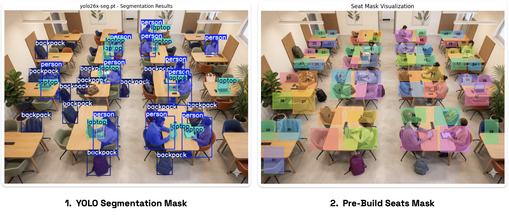
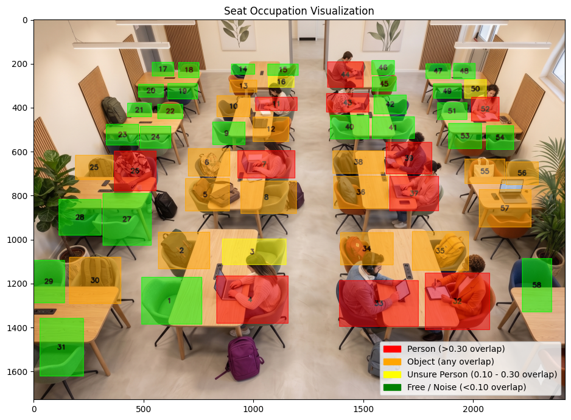
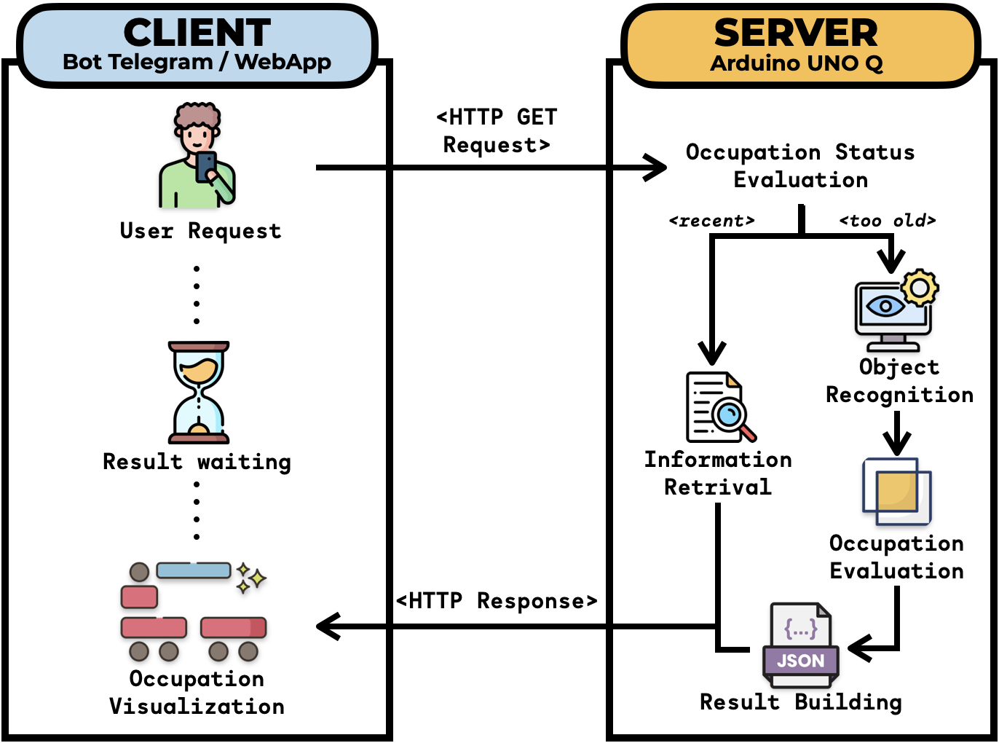

# 📍P.I.E.N.A.H - Private Image Evaluation Network on Arduino Hardware


## 🔍 Overview
P.I.E.N.A.H is an Edge AI-powered system designed to analyze and determine seat occupancy in a classroom environment. It leverages a YOLO-based segmentation model to detect objects (such as people, laptops, and backpacks) and maps these detections to predefined seat masks to determine the availability of each seat. The entire system is implemented on an Arduino Uno Q Board, ensuring scalability, low cost and privacy by processing data locally without the need for cloud services.

## 📋 Table of Contents
- [Overview](#overview)
- [Usage Example](#usage-example)
- [Project Structure](#project-structure)
- [Hardware Architecture](#hardware-architecture)
- [Software Architecture](#software-architecture)
- [Backend Logic](#backend-logic)
- [Installation](#installation)
- [Credits](#credits)


## 📍 Usage Example
Starting from an Image acquisition of a classroom/study room, the system evaluates the **occupancy status** by merging two key sources of information:
1. **YOLO Segmentation Masks**: The model detects and segments objects of interest (people, laptops, backpacks) in the image, generating pixel-level masks for each detected instance.
2. **Seat Masks**: Each classroom has a predefined JSON configuration that defines the exact polygon coordinates of each seat. The system generates binary masks for these seats based on the provided configurations.

Then the detection algorithm computes the intersection between each seats with an eventual detected object, calculating the percentage of overlap and wich type of object is occupying the seat. For each seat, the possible outcomes are:
- `free`: No significant overlap with any detected object.
- `occupied`: Significant overlap with a detected object (person, laptop, backpack). The system also identifies the type of object occupying the seat based on the class of the detected object (e.g., a person, a laptop, or a backpack).
- `unknown`: If the overlap is ambiguous or below the defined thresholds, the seat status may be marked as `unknown` for further review.


Finally, the system exposes a REST API endpoint (`/api/status`) that returns a JSON payload detailing the occupancy status of each seat, ensouring that sensible data is processed locally and only the final occupancy status is shared, preserving privacy and security.
```json
[
    {
        "seat_id": 1,
        "occupied": false,
        "seat_overlap_ratio": 0.0,
        "occupated_by_segment_id": null
    },
    {
        "seat_id": 2,
        "occupied": true,
        "seat_overlap_ratio": 0.44685916919959473,
        "occupated_by_segment_id": "backpack"
    },
    {
        "seat_id": 3,
        "occupied": true,
        "seat_overlap_ratio": 0.1445337526938086,
        "occupated_by_segment_id": "person"
    },
    ...
]
```

## 📁 Project Structure
```text
.
├── backend/                 # Backend FastAPI server and AI detection logic
│   ├── data/                # Input classroom images
│   ├── mask/                # Predefined seat masks and configurations (JSON)
│   ├── output/              # Generated seat occupancy results
│   ├── weights/             # YOLO model weights
│   ├── detection_main.py    # Core logic for computing detections and seat overlap
│   └── testing-notebook.ipynb # Notebook for testing the YOLO model and segmentation
├── frontend/                # Frontend application components
│   ├── app.py               # Main frontend application
│   ├── seat_mask_editor.html # Tool for creating and editing seat masks
│   ├── telegram_bot.py      # Telegram bot integration
│   └── templates/           # HTML templates and images
├── pyproject.toml           # Project metadata and dependencies (for uv)
├── requirements.txt         # Classic pip dependencies
└── README.md                # This file
```

## 🏗️ Hardware Architecture 
The system is designed to run on an **Arduino Uno Q Board**, equipped with a Qualcomm MPU and 2GB of RAM, which provides sufficient computational power to handle the YOLO segmentation model and the associated processing tasks. The board is connected to a camera module that captures real-time images of the classroom. The processing pipeline runs locally on the Arduino, ensuring that all image data is processed on-device, thus maintaining privacy and reducing latency.

## Software Architecture
The software implementation follows a classic client-server architecture, separating the concerns of data processing and user interaction:
- **Backend (Server)**: handles the core logic of image processing, object detection, and seat occupancy evaluation. It exposes a REST API for the frontend to fetch the occupancy status.
- **Frontend (Client)**: provides a user interface for visualizing the occupancy status of the classroom. It periodically requests the latest occupancy data from the backend and updates the display accordingly.




## ⚙️ Backend Logic
The backend operates as a computer vision pipeline wrapped in a **FastAPI** server, specifically designed to monitor real-time classroom occupancy.

### 1. Object Detection and Segmentation
At its core, the backend uses a pre-trained **YOLO** segmentation model. When a status request is made, the model performs inference on the classroom image to detect specific objects of interest (people, laptops, backpacks). It outputs both bounding boxes and pixel-level segmentation masks for these elements.

### 2. Seat Mapping and Intersections
Rather than compiling a simple crowd count, the system maps the detections to specific physical seats:
- **Seat Configurations:** Each classroom structure is stored in a JSON file (`classroom_{id}_seats.json`) containing exact polygon coordinates for every seat.
- **Overlap Calculation:** The detection engine (inside `detection_main.py`) generates a binary physical mask for each seat and checks the intersection with the YOLO segmentation masks.
- **Occupancy Thresholds:** A seat is marked as `occupied` if the overlap between the detected object and the seat geometry exceeds a defined ratio (`min_seat_overlap` or `min_person_overlap`). The system also identifies *what* is occupying the seat.

### 3. API REST Endpoints
The entire logic is exposed via a seamless REST API:
- `GET /api/status`: Fetches the calculated occupancy data. It checks the timestamps of the generated outputs for freshness and returns a JSON payload detailing the individual status of every seat (free vs. occupied).

## 🚀 Installation

This project requires **Python >= 3.13**. 
The repository has been initializated with `uv` package manager, but it also supports the classic `venv` + `pip` workflow.

- Option 1: Classic method (`venv` + `pip`): 


- Option 2: Fast method (using `uv`)

### Option 1: Classic method (`venv` + `pip`)

1. Create a virtual environment:
   ```bash
   python -m venv .venv
   ```

2. Activate the virtual environment:
   * **Windows:** `.venv\Scripts\activate`
   * **macOS/Linux:** `source .venv/bin/activate`

3. Install the required libraries:
   ```bash
   pip install -r requirements.txt
   ```

### Option 2: Fast method (using `uv`)
If [`uv`](https://docs.astral.sh/uv/) is installed:

1. Sync the environment and install dependencies:
   ```bash
   uv sync
   ```


   172.18.106.198
   http://172.18.106.198:5000

## 👥 Credits

Made with ❤️ by:
- [**Andrea Camoia**](https://github.com/AndCamo)
- [**Andrea Cavaiuolo**](https://github.com/AndreaCavaiuolo)
- [**Arianna Rossi**](https://github.com/arianna-rossi)
- [**Edoardo Pepe**](https://github.com/Ed04rd0P3)
- [**Franscesco Siviero**](https://github.com/francesco2310)
- [**Mariapia Marsico**](https://github.com/mariapiamarsico0-dotcom)
- [**Michael De Leo**](https://github.com/michaeldeleo99)